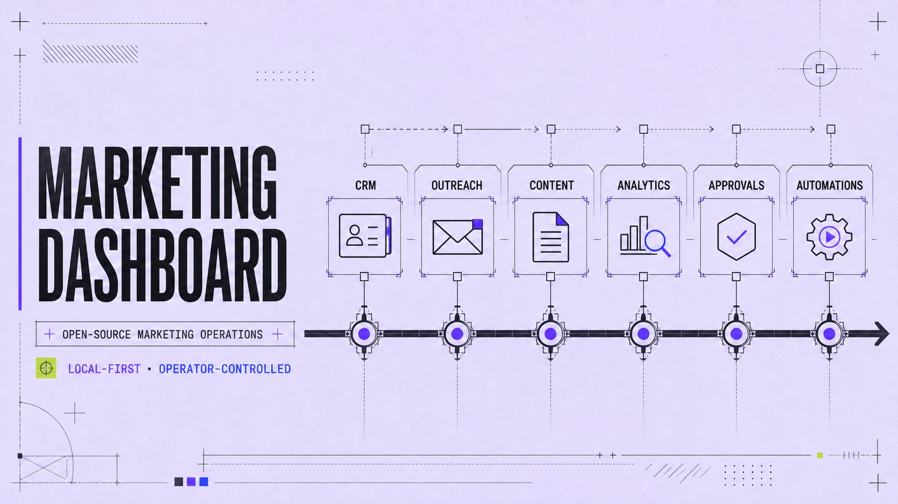
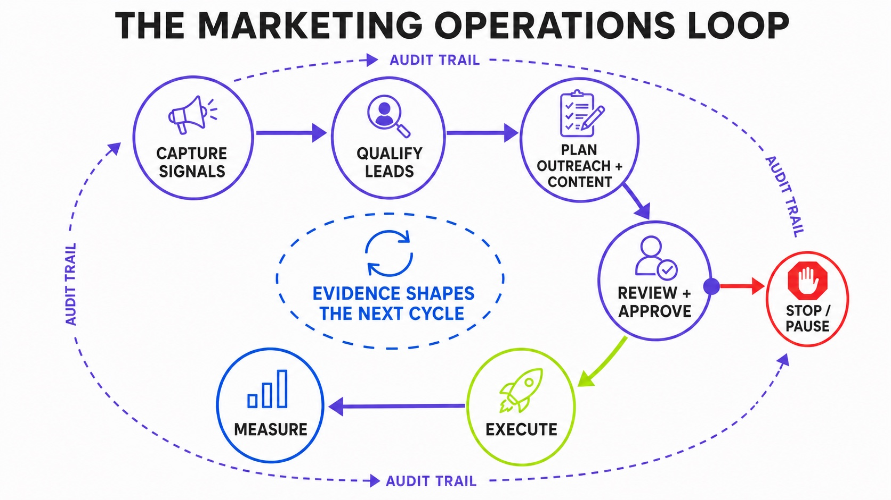
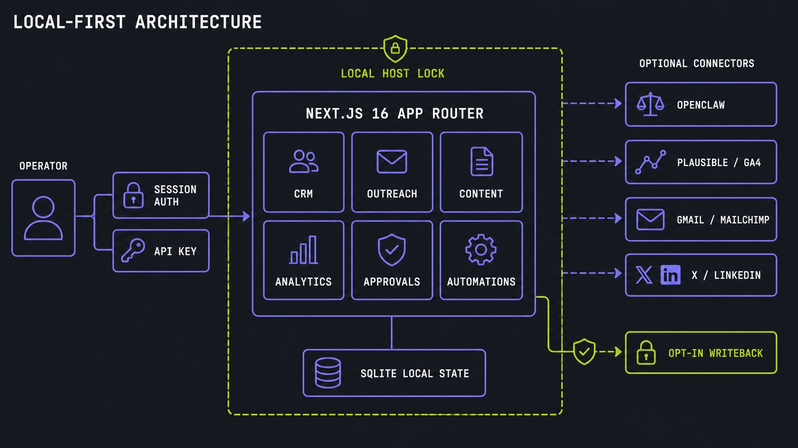
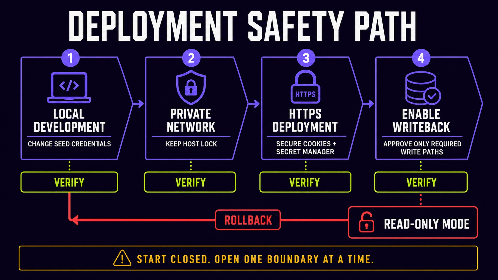

<p align="center">
  
</p>

<p align="center">
  <strong>A local-first marketing operations control center for teams running human and agent workflows.</strong>
</p>

<p align="center">
  <a href="LICENSE"></a>
  <a href="https://github.com/builderz-labs/marketing-dashboard/actions/workflows/ci.yml"></a>
  <a href="https://nextjs.org/"></a>
  <a href="https://github.com/builderz-labs/marketing-dashboard"></a>
</p>

---

Marketing Dashboard brings CRM, outreach, content planning, analytics, approvals, automation schedules, and agent activity into one self-hosted interface. It runs on Next.js and SQLite, works without required hosted infrastructure, and can connect to OpenClaw and external marketing services when you choose.

> **Project status:** alpha. The working surface is broad, but APIs, schemas, and configuration may change between releases.

## What it controls

| Area | Current surface |
|---|---|
| CRM | Leads, sources, pipeline stages, lead quality, and record details |
| Outreach | Sequences, suppression, pausing, audits, and engagement |
| Content | Calendar, content items, performance, and approval queues |
| Analytics | KPI views plus optional Plausible, GA4, X, and LinkedIn connectors |
| Agents | OpenClaw instance discovery, squads, workspaces, sessions, and communications |
| Automations | Cron jobs, templates, approvals, activity, and deployment status |

The dashboard is operator-led. Approval, pause, writeback, and host-access controls remain visible instead of being hidden behind autonomous execution.



## Quick start

### Requirements

- Node.js 20
- pnpm 10
- A local machine or private host that can persist SQLite state

### Run locally

```bash
git clone https://github.com/builderz-labs/marketing-dashboard.git
cd marketing-dashboard
corepack enable
pnpm install --frozen-lockfile
pnpm env:bootstrap
pnpm dev
```

Open `http://localhost:3000`.

The first login is seeded from `AUTH_USER` and `AUTH_PASS` when the users table is empty. Change the example credentials in `.env.local` before starting the application.

## Local-first architecture

The application, authentication, and SQLite state run locally. Provider connectors are optional and receive credentials from server-side environment variables.



| Layer | Implementation |
|---|---|
| Application | Next.js 16 App Router, React 19, TypeScript |
| Interface | Tailwind CSS 4, Recharts, Zustand |
| State | SQLite through `better-sqlite3` |
| Authentication | Session cookie, API key, optional Google OAuth |
| Agent connection | OpenClaw CLI and filesystem discovery |
| Deployment | Local process, standalone build, or private HTTPS host |

Environment variables retain the `HERMES_*` prefix for backward compatibility with existing deployments. The public project name is Marketing Dashboard.

## Configuration

Copy [`.env.example`](.env.example) to `.env.local` through `pnpm env:bootstrap`, then replace all seed secrets.

### Required

| Variable | Purpose |
|---|---|
| `AUTH_USER` | Initial admin username |
| `AUTH_PASS` | Initial admin password, minimum 10 characters |
| `API_KEY` | API and webhook authentication |
| `AUTH_COOKIE_SECURE` | Set `true` on HTTPS deployments |

### Runtime and host boundaries

| Variable | Default | Purpose |
|---|---|---|
| `HERMES_STATE_DIR` | `./state` | Local SQLite and runtime state |
| `HERMES_OPENCLAW_HOME` | `~/.openclaw` | Default OpenClaw home |
| `HERMES_HOST_LOCK` | `local` | Restrict accepted hosts |
| `HERMES_ALLOW_POLICY_WRITE` | `false` | Allow policy file changes |
| `HERMES_ALLOW_CRON_WRITE` | `false` | Allow cron file changes |
| `HERMES_ALLOW_WORKSPACE_WRITE` | `false` | Allow agent workspace changes |

Multi-instance discovery uses `HERMES_OPENCLAW_INSTANCES`, a JSON array documented in [`.env.example`](.env.example).

### Optional integrations

- Google OAuth
- Plausible and Google Analytics 4
- Gmail and Mailchimp
- Sanity
- Helius
- X and LinkedIn
- 1Password runtime environment overlays
- Ollama model-health checks

Every integration is optional. Keep unused credentials unset.

## Deployment safety

Start with a local read-only posture, verify each boundary, and enable writeback only for operations you intend to expose.



- Replace `AUTH_USER`, `AUTH_PASS`, and `API_KEY`.
- Keep `HERMES_HOST_LOCK=local` unless you have an explicit host allowlist.
- Use HTTPS and `AUTH_COOKIE_SECURE=true` outside local development.
- Load production secrets from a secret manager or runtime environment.
- Leave all `HERMES_ALLOW_*_WRITE` variables disabled until their write paths are required and reviewed.
- Return to read-only mode by disabling the writeback flags.

See [SECURITY.md](SECURITY.md) for private vulnerability reporting and supported-version policy.

## Screenshots

### Mission-control overview


### CRM and operating surfaces


The screenshot filenames retain their original names for compatibility with existing links.

## Development

```bash
pnpm lint
pnpm typecheck
pnpm test
pnpm build
pnpm test:e2e
bash ./scripts/template-audit.sh
```

The CI workflow runs the template audit, lint, typecheck, unit tests, production build, and Playwright tests.

## Standalone deployment

```bash
pnpm build:standalone
pnpm start
```

Operational examples for systemd and 1Password live under [`ops/`](ops/).

## Template export

Before sharing or publishing a derived template:

```bash
bash ./scripts/template-audit.sh
bash ./scripts/template-export.sh ./export
```

The export excludes environment files, databases, build output, dependency directories, test artifacts, and runtime state.

## Repository policy

- [CONTRIBUTING.md](CONTRIBUTING.md) describes development and PR evidence.
- [SECURITY.md](SECURITY.md) defines private reporting.
- [CODE_OF_CONDUCT.md](CODE_OF_CONDUCT.md) covers community participation.
- [THIRD_PARTY_NOTICES.md](THIRD_PARTY_NOTICES.md) records dependency notices.
- [CHANGELOG.md](CHANGELOG.md) tracks project changes.

Use [GitHub Issues](https://github.com/builderz-labs/marketing-dashboard/issues) for reproducible bugs and scoped feature requests. Security reports must not be filed publicly.

## Built by Builderz

[Builderz](https://builderz.dev) builds agent infrastructure, trading systems, and Solana applications.

Maintained by [Nyk](https://nyk.dev). [Sponsor ongoing open-source maintenance](https://github.com/sponsors/0xNyk) or follow [@nykdotdev](https://x.com/nykdotdev).

## License

Licensed under the [MIT License](LICENSE).
